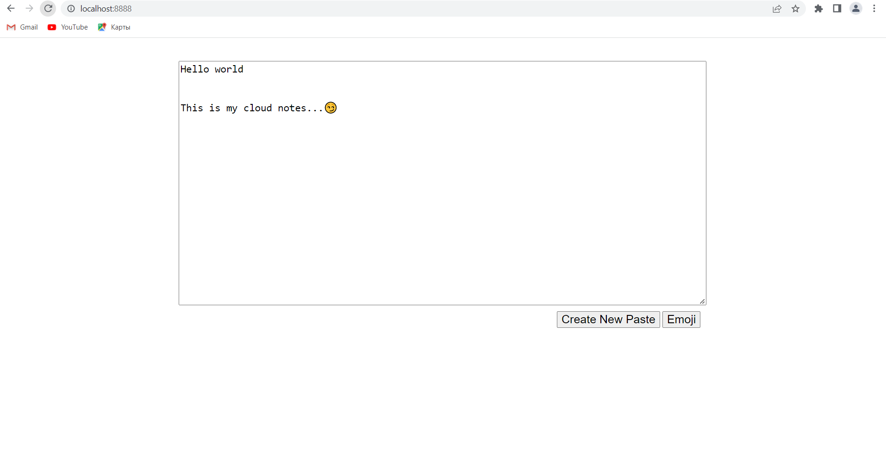
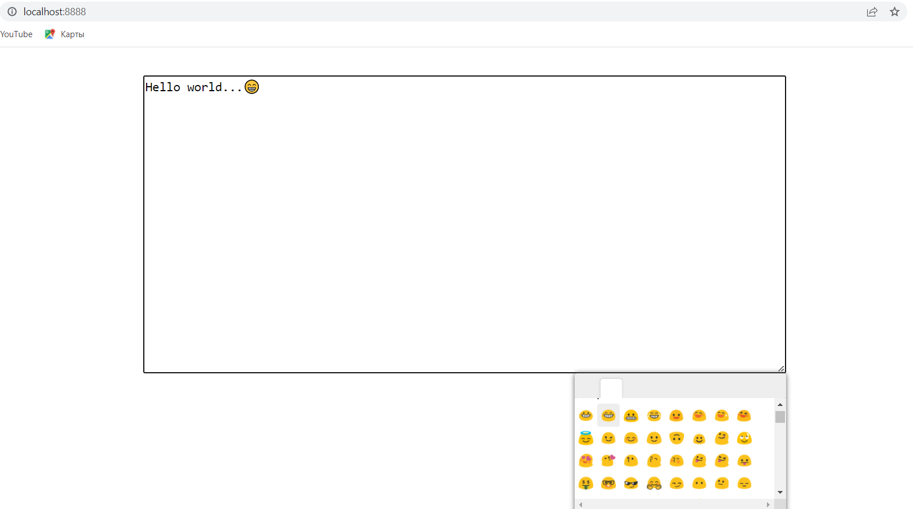
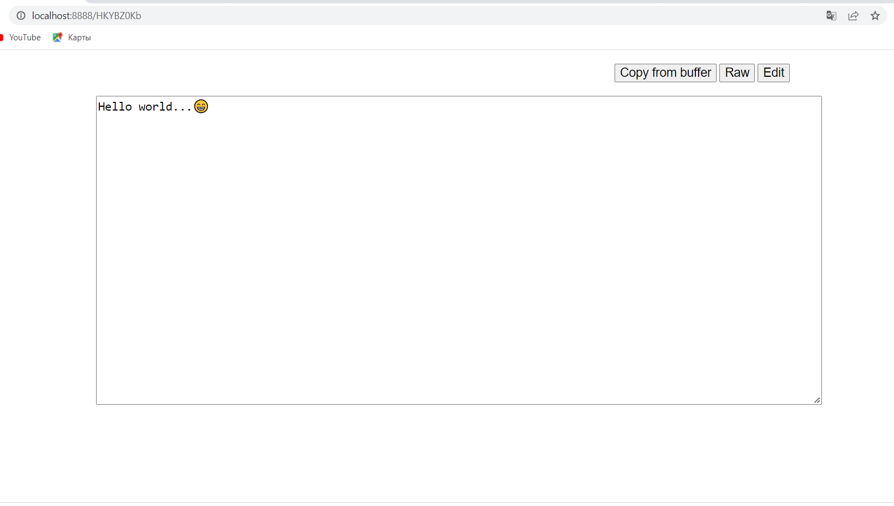

Pastebin textpad is a standalone version of cloud notepad. Allows to share any text data by unique links.
This program supports emoji insertion, editing and note taking
Written in Go and Bolt as embedded key/value database. 

## Preview
<h3>Main page</h3>

<h3>Emoji</h3>

<h3>Edit page</h3>


## Build

```
go build main.go
```
## Usage

```
Usage:
  pad [OPTIONS]

Application Options:
      --db=      path to database (default: ./db) [$PAD_DB_PATH]
      --secret=  secret key [$PAD_SECRET]
      --host=    host (default: 0.0.0.0) [$PAD_HOST]
      --port=    port (default: 8080) [$PAD_PORT]
      --path=    path to web assets (default: ./web) [$PAD_PATH]
  -v, --verbose  enable verbose logging
      --version  show the version number and information

Help Options:
  -h, --help     Show this help message
```

## Environment variables

### DB_PATH

* *default:* `./db`

Path to BoltDB database. It represents a consistent snapshot of your data.

### HOST

* *default:* `0.0.0.0`

### PORT

* *default:* `8080`

This a bind port.


## License

http://www.opensource.org/licenses/mit-license.php